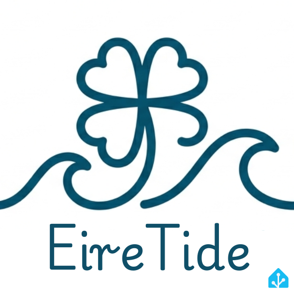

# EireTide

A Home Assistant custom integration for Irish tide predictions, built on the
[Marine Institute](https://www.marine.ie/)'s open tide prediction data.
Works for any station in their network, and defaults to **Howth**.

## What you get

Each configured station is added as a device with these entities:

| Entity | Description |
| --- | --- |
| `sensor.*_current_tide_height` | The main entity — estimated tide height (metres) right now |
| `sensor.*_next_tide_time` | Timestamp of the next high or low tide |
| `sensor.*_next_tide_type` | `High` or `Low` |
| `sensor.*_next_tide_height` | Predicted height (metres) of the next tide |
| `sensor.*_following_tide_time` | Timestamp of the tide after next |
| `sensor.*_following_tide_type` | `High` or `Low` |
| `sensor.*_following_tide_height` | Predicted height (metres) of the tide after next |
| `binary_sensor.*_tide_rising` | `on` while the tide is rising towards the next high |

The `sensor.*_next_tide_time` entity also exposes an `upcoming_tides`
attribute listing the next 10 predicted tide events, for use in cards or
automations.

`sensor.*_current_tide_height` isn't a direct measurement — the Marine
Institute dataset only publishes high/low predictions, not a continuous
curve. The value is interpolated between the surrounding predicted high and
low using a cosine curve, which is accurate to within a few centimetres for
Ireland's semi-diurnal tides. It refreshes every 5 minutes so it moves
smoothly between the half-hourly prediction fetches.

## Data source

Tide predictions are fetched from the Marine Institute's public
[ERDDAP](https://erddap.marine.ie/erddap/tabledap/IMI_TidePrediction_HighLow.html)
server — no API key or account is required. The integration discovers the
dataset's column names and station list at setup time rather than hardcoding
them, so it adapts automatically if the Marine Institute changes their schema.

Data is refreshed every 30 minutes.

## Installation

### HACS (recommended)

1. In HACS, add this repository as a custom repository (category:
   Integration).
2. Install "Irish Tides".
3. Restart Home Assistant.

### Manual

1. Copy `custom_components/irish_tides` into your Home Assistant
   `config/custom_components/` directory.
2. Restart Home Assistant.

## Configuration

1. Go to **Settings → Devices & Services → Add Integration** and search for
   **Irish Tides**.
2. Pick a station from the dropdown (Howth is pre-selected if available).
   If the station list can't be loaded, you can type the station name
   manually.
3. Repeat to add additional stations — each station is a separate config
   entry.

## Branding

`custom_components/irish_tides/brand/` ships `icon.png` and `logo.png`.
Home Assistant 2026.3+ serves brand images straight from an integration's
own `brand/` folder (no submission to the separate `home-assistant/brands`
repo needed), so the icon/logo show up in the integrations list, config
flow, and device pages automatically — nothing else to configure. On older
Home Assistant versions this folder is simply ignored and the integration
falls back to the generic puzzle-piece icon.

## Notes

- This integration is not affiliated with, or endorsed by, the Marine
  Institute. It simply consumes their published open data.
- Tide *predictions*, not real-time observations — treat them as forecasts,
  not a substitute for official navigation data.
